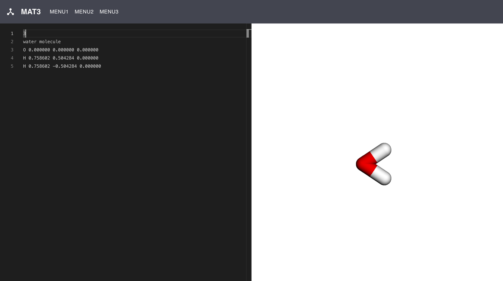
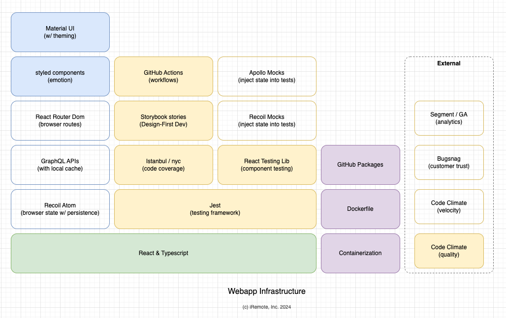

# materials-app

Demo app for visualizing materials data using [XYZ](https://en.wikipedia.org/wiki/XYZ_file_format) file format.



## Architecture & Tooling Infra



## Development

### Folder Structure

1. `src` - Contains the source code for the app.
2. `src/components` - Contains the reusable components.
3. `src/pages` - Contains the pages of the app.
4. `src/theme` - Contains the theme for the app.

### Design-first Development (DFD)

DFD approach is used to build this app, using Storybook for UI.
You may create templated components using

```bash
yarn create-tsx src/components/ComponentName
```

This will create desired components and files in the `src/components/ComponentName` directory.

View the components in Storybook using

```bash
yarn storybook
```

This will launch Storybook at [http://localhost:6006](http://localhost:6006).

## Building on local machine

Refer to [package.json](./package.json) for project requirements (node, yarn, etc).

```bash
yarn install
yarn start
```

This will launch the app at [http://localhost:3000](http://localhost:3000).

## Quality

We use CRA (Create React App) supplied tooling (nyc, istanbul, etc.) for testing and coverage.
`package.json` has the scripts to run tests and coverage.

## Deployment

Refer to [README-prod.md](./README-prod.md) for production deployment.

## Contributors & Authors

Ramesh Doddi <ramesh@iremote.ai>

## License

Refer to [LICENSE](./LICENSE) file.
